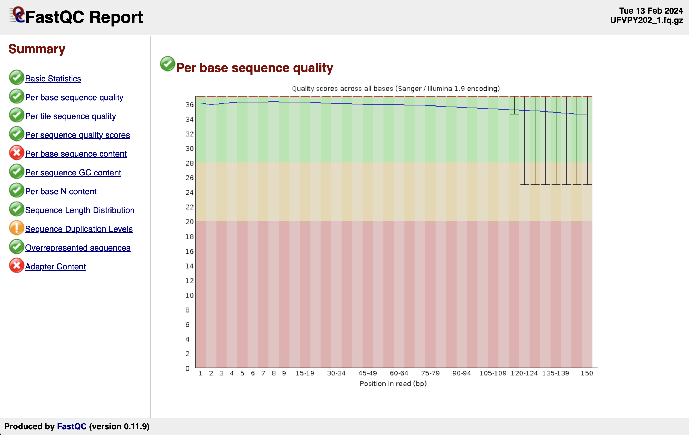

# MyGenome
Analyses for ABT480/CS485G genome assembly

## 1. Analysis of sequence quality
The F1 and R1 sequence datasets were analysed using FASTQC: 
```bash
ssh -Y ukyID@ukyID.cs.uky.edu
cd MyGenome
fastqc &
```
Load F1 and R1 datasets into GUI interface.
Take screen shots of output files:
.
.

## 2. Trimming of sequences
The sequences were then trimmed utilizing Trimmomatic:
```bash
java -jar ~/assembly/trimmomatic-0.38.jar PE -threads 2 -phred33 -trimlog UFVPY202_errorlog.txt UFVPY202_1.fq.gz UFVPY202_2.fq.gz UFVPY202_1_paired.fastq UFVPY202_1_unpaired.fastq UFVPY202_2_paired.fastq UFVPY202_2_unpaired.fastq ILLUMINACLIP:adaptors.fasta:2:30:10 SLIDINGWINDOW:20:20 MINLEN:120
```
These were then analysed utilizing FASTQC:
```bash
fastqc UFVPY202_1_paired.fastq UFVPY202_1_unpaired.fastq UFVPY202_2_paired.fastq UFVPY202_unpaired.fastq
```
Take screen shots of the output files:
.
.

## 3. Counting the number of paired reads and the total number of bases
From the paired reads we then can then count the number of paired reads and the total number of bases. 
To count the number of paired reads after cleaning:
```bash
grep -c '@A00261:902' UFVPY202_1_paired.fastq
```
Count: 9,686,169

To count the total number of bases in cleaned reads:
```bash
cat UFVPY202_1_paired.fastq UFVPY202_2_paired.fastq | grep -v "+"| grep -e "F" -e "#" -e ":" -e "," | wc -c
```
Count: 2,923,408,486

## 4.Assembly of MyGenome
Upload the forward and reverse trimmed paired files to the Morgan Compute Cluster
  
Copy the VelvetOptimiser script to your personal directory and add email using nano
```bash
cp ../SLURM_SCRIPTs/velvetoptimiser_noclean.sh .
nano velvetoptimiser_noclean.sh
```
Submit assemblies to the SLURM queue
```bash
sbatch velvetoptimiser_noclean.sh <genomeID> <start_kmer> <end_kmer> <step_size>
```
  For this SLURM queue the start k-mer was 61, the end k-mer was 131, and the step size was 10.
  
Inspect assembly file
```bash
nano /path to log file
```
  Upon inspection the range of kmer values to use for the next VelvetOptimiser run was determined to be 91 to 111.

Re-run VelvetOptimiser witha  narrower k-mer range and step size of 2
```bash
sbatch velvetoptimiser_noclean.sh <genomeID> <start_kmer> <end_kmer> <step_size>
```
 For this SLURM queue the start k-mer was 91, the end k-mer was 111, and the step size was 2.
 
Rename optimized assembly according to the format GenomeID.fasta
```bash
mv contigs.fa genomeID.fasta
```

Use SimpleFastaHeaders.pl perl script to rename sequence headers to a standard format
```bash
//copy script to current directory
cp ../SCRIPTs/SimpleFastaHeaders.pl genomeID.fasta
//add email to script
nano SimpleFastaHeaders.pl
//run script
perl /path to SimpleFastaHeaders.pl /path to genomeID.fasta genomeID
```


## 5. Check genome completeness using BUSCO
Within the MCC supercomputer, copy the BuscoSingularity.sh script to your working directory
```bash
cd //path to working directory
cp ../SLURM_SCRIPTS/BuscoSingularity.sh .
```

Run BUSCO
```bash
sbatch /path to BuscoSingularity.sh genomeID.fasta
```
Inspect the BUSCO log
```bash
cat busco_logID.log
```


## 6. BLASTing MyGenome
Copy the CullShortContigs.pl script from the MCC to VM
```bash
scp ukyID@mcc.uky.edu:../SCRIPTs/CullShortContigs.pl .
```
Remove any contigs in MyGenome assembly that are less than 200 bp in length
```bash
perl CullShortContigs.pl ~/MyGenome/genomeID_nh.fasta
```
Check that it worked using the SequencesLength.pl
```bash
//copy SequencesLength.pl from MCC to VM
scp ukyID@mcc.uky.edu:..//SCRIPTs/SequencesLength.pl .
//run the script
perl SequenceLengths.pl ~/MyGenome/genomeID_final.fasta
```
Determine which contigs in the assembly correspond to the mitochondrial genome
  BLAST MoMitochondrion.fasta sequence against final genome assembly using output format 6 with specific column sections
```bash
//enter blast directory within VM
cd blast
//download MoMitochondrion.fasta
scp -r AppliedBioInfo@address:~/Desktop/MoMitochondrion.fasta .
//run the blast
blastn -query MoMitochondrion.fasta -subject MyGenome_nh.fasta -evalue 1e-50 -max_target_seqs 20000 -outfmt '6 qseqid sseqid slen length qstart qend sstart send btop' > B71v2sh.MyGenome.BLAST
//export a list of contigs that mostly comprise the mitochondrial sequence
awk '$3/$4 > 0.9 {print $2 ",mitochondrion"}' B71v2sh.MyGenome.BLAST > MyGenome_mitochondrion.csv
```

BLAST the genome assembly against a repeat-masked version of the B71 reference genome:
```bash
//within the MCC
//copy B71v2sh_masked.fasta genome to own directory
//run a blast search
```

[UFVPY202_mitochondrion.csv](https://github.com/LeighanneLyvers/MyGenome/blob/main/UFVPY202_mitochondrion.csv)
**insert MoMitochondrion.UFVPY202.BLAST, B71v2sh.UFVPY202.BLAST**

## 7. Gene Prediction
**SNAP**
Start a screen that begins bash as a login shell, ensuring the environment variables needed are set correctly.
```bash
screen -S genes bash -l
```
Change into the snap directory
```bash
cd ~/genes/snap
```
Download B71ref2.fasta and B71Ref2_a0.3.gff3 files from the Farman Mac Desktop
```bash
scp FarmanMacDesktopAddress:~/Desktop/B71ref2.fasta .
scp FarmanMacDesktopAddress:~/Desktop/B71Ref2_a0.3.gff3 .
```
Append the genome fasta sequence to the end of the gff3 file
```bash
echo '##FASTA' | cat B71Ref2_a0.3.gff3 - B71Ref2.fasta > B71Ref2.gff3
```
Check the format of the B71Ref2.gff3 file
```bash
grep '##FASTA' -B 5 -A 5
```
Convert MAKER annotation to ZFF for SNAP
```bash
maker2zff B71Ref2.gff3
```
Train the HMM using the forge tool
```bash
forge export.ann export.dna
```
Condense everything into a single file for use with runs of SNAP
```bash
hmm-assembler.pl Moryzae . > Moryzae.hmm
```
Run SNAP
```bash
snap-hmm Moryzae.hmm MyGenome.fasta > MyGenome-snap.zff
```
Generate a GFF file in the older GFF2 format
```bash
snap-hmm Moryzae.hmm MyGenome.fasta -gff > MyGenome-snap.gff2
```
Resulting File:
**insert MyGenome-snap.gff2**

**AUGUSTUS**
Run AUGUSTUS 
```bash
augustus --species=magnaporthe_grisea --gff3=on --singlestrand=true --progress=true ../snap/MyGenome.fasta > MyGenome-augustus.gff3
```
Meaning of the parameters:
```bash
--species=magnaporthe_grisea //Specifies the parameter file to use
--gff3=on //Produce GFF3-format output 
--singlestrand=true //Predict genes on each strand separately;
--progress=true //show a progress bar for each step of the gene finding process
```
**insert MyGenome-augustus.gff3**

**MAKER**
Create the MAKER configuration files
```bash
maker -CTL
```
Open the configuration file maker_opts.ctl 
```bash
nano maker_opts.ctl
```
Make the following configurations:
genome=/home/yourusername/genes/snap/MyGenome.fasta
model_org= must be set to blank
repeat_protein= must be set to blank
snaphmm=/home/yourusername/genes/snap/Moryzae.hmm
augustus_species=magnaporthe_grisea
keep_preds=1
protein=/home/yourusername/genes/maker/genbank/ncbi-protein/Magnaporthe_organism.fasta

Save and close this file
Run MAKER
```bash
//run screen
maker 2>&1 | tee maker.log
//the above will run MAKER but will also log errors, not just the normal output. It will send errors to the pipe using the 2>&1

//merge everything together into one GFF file
gff3_merge -d MyGenome.maker.output/MyGenome_master_datastore_index.log -o MyGenome-annotations.gff
```
The result is a .gff file and a .fasta file that contains the predicted genes

**insert .gff and .fasta file**

----


